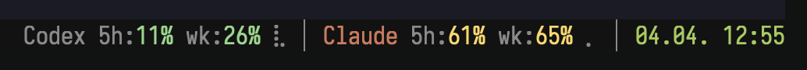

# tmux-agent-usage

Display AI agent rate limit usage in your tmux status bar. Shows session and
weekly utilization for Codex and Claude with color-coded percentages and a
braille reset indicator.



- **Green** < 50%, **yellow** 50–79%, **red** 80%+
- Braille character after weekly % shows time until reset (fuller = more time)
- Cache-first with 55s TTL — tmux refreshes stay instant

## Install

### Shell (recommended)

```bash
curl -fsSL https://raw.githubusercontent.com/raine/tmux-agent-usage/main/scripts/install.sh | bash
```

### Homebrew

```bash
brew install raine/agent-usage/agent-usage
```

### Cargo

```bash
cargo install --git https://github.com/raine/tmux-agent-usage
```

## tmux setup

### With TPM

Add to `~/.tmux.conf`:

```tmux
# Configure which providers to show (default: codex)
set -g @agent-usage-providers "codex claude"

set -g @plugin 'raine/tmux-agent-usage'
```

The plugin auto-installs the binary if not found in PATH.

### Manual

```tmux
set -g status-right-length 120
set -g status-right '#(agent-usage codex)#(agent-usage claude)#[fg=green]%d.%m. %H:%M'
```

Then reload: `tmux source ~/.tmux.conf`

## Providers

### Codex

Probes rate limits via JSON-RPC by spawning `codex app-server`, with a PTY
fallback that sends `/status` and parses the output. Requires `codex` in PATH
(or set `CODEX_BINARY` env var).

### Claude

Reads OAuth credentials from macOS Keychain (falling back to
`~/.claude/.credentials.json`) and queries the
`api.anthropic.com/api/oauth/usage` endpoint. Requires being logged into Claude
Code.

## Usage

```bash
# Show all providers
agent-usage

# Show a specific provider
agent-usage codex
agent-usage claude

# Debug mode (prints raw JSON snapshot, bypasses cache)
agent-usage --debug-probe
agent-usage claude --debug-probe
```

## How it works

1. **Cache-first**: reads per-provider cache from
   `~/.cache/agent-usage/<provider>.json`. If fresh (< 55s), prints immediately
   and exits.
2. **Stale-serve**: if cache exists but is stale, prints it immediately (no tmux
   lag), then tries to refresh behind a file lock.
3. **Probe**: if no cache exists (first run), probes synchronously.
4. **Locking**: file locks prevent thundering herd from multiple tmux panes.
   Atomic writes via PID-suffixed temp files prevent cache corruption.

## Adding a provider

The architecture is provider-agnostic. To add a new provider:

1. Create `src/provider/<name>/mod.rs` implementing the `Provider` trait
2. Add probe modules as needed
3. Register in `provider::registry()`
4. Cache, formatting, and CLI are automatically per-provider

## Development

```bash
# Run all checks (fmt, clippy, build, test)
just check

# Install debug binary via symlink
just install-dev

# Run directly
cargo run -- codex
cargo run -- claude --debug-probe
```

## Related projects

- [tmux-file-picker](https://github.com/raine/tmux-file-picker) — A fuzzy file
  picker in a tmux popup
- [workmux](https://github.com/raine/workmux) — Git worktrees + tmux windows for
  parallel AI agent workflows
- [claude-history](https://github.com/raine/claude-history) — Fuzzy-search
  Claude Code conversation history
- [git-surgeon](https://github.com/raine/git-surgeon) — Surgical,
  non-interactive git hunk control for AI agents
- [consult-llm-mcp](https://github.com/raine/consult-llm-mcp) — MCP server for
  consulting powerful reasoning models in Claude Code
